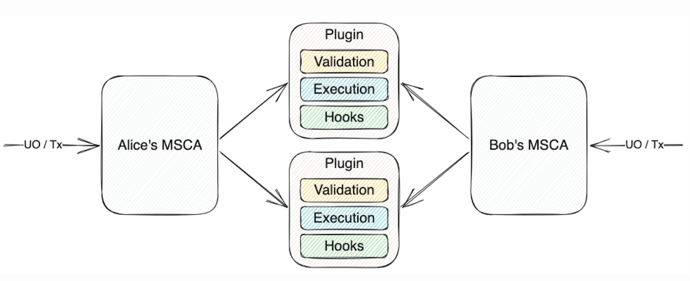

# Learn

## The standard

[ERC-6900](https://eips.ethereum.org/EIPS/eip-6900) seeks to foster a growing ecosystem of both smart account and plugin developers by standardizing basic functions and interfaces. At a high level, it does this by standardizing how accounts and plugins interact with each other, as well as the pre-installation requirements for plugins.&#x20;

More specifically, the standard focuses on two key goals:&#x20;

* Provide standards for designing plugins for smart contract accounts.
* Provide standards for how compliant accounts should interact with plugins.

To learn more about the standard and its goals, read this [blog post](https://alchemy.com/blog/account-abstraction-erc-6900).&#x20;

\

## Design goals

ERC-6900 is designed to enable developers across the ecosystem to build interoperable and secure smart account components. It is built and continues to be developed around a clear set of goals:&#x20;

* Standardize nomenclature, terms, definitions, and interfaces
* Compatibility with but no dependence on ERC-4337
* Maximize flexibility for dApp developers to become plugin developers while providing constraints to minimize security risks (optimize for extensibility and security)
* Eliminate plugin developer lock in into specific account implementations
* Reduce fragmented development efforts that would be unique to particular implementations or ecosystems
* Minimize complexity and ability to land in undefined account states
* Be as non-prescriptive as possible in the functionality enabled by the standard

Read more about  the  standard's architecture  at  [Ethereum Magicians](https://eips.ethereum.org/EIPS/eip-6900).\
\

### Standardizing plugins

Plugin designers following the standard can work with three standardized components:

* Validation functions ensure the validity of external calls to the smart account.
* Execution functions are smart contracts that specify the execution logic for functions within a plugin.
* Hooks specify more fine-grained actions and validations that can be designed to occur pre- or post-validation, and pre- or post-execution.

<figure><figcaption></figcaption></figure>

### Standardizing interfaces

The standard also builds on earlier [work](https://developer.android.com/guide/topics/permissions/overview) by the Android developer community to standardize the interface between smart accounts and plugins. Each compliant plugin will incorporate a manifest that establishes various functions and hooks that need to be added to the smart account on installation. It will also specify aspects of the plugin (metadata, dependencies and permissions) that are necessary to constrain the plugin’s ability to act on the smart account.
